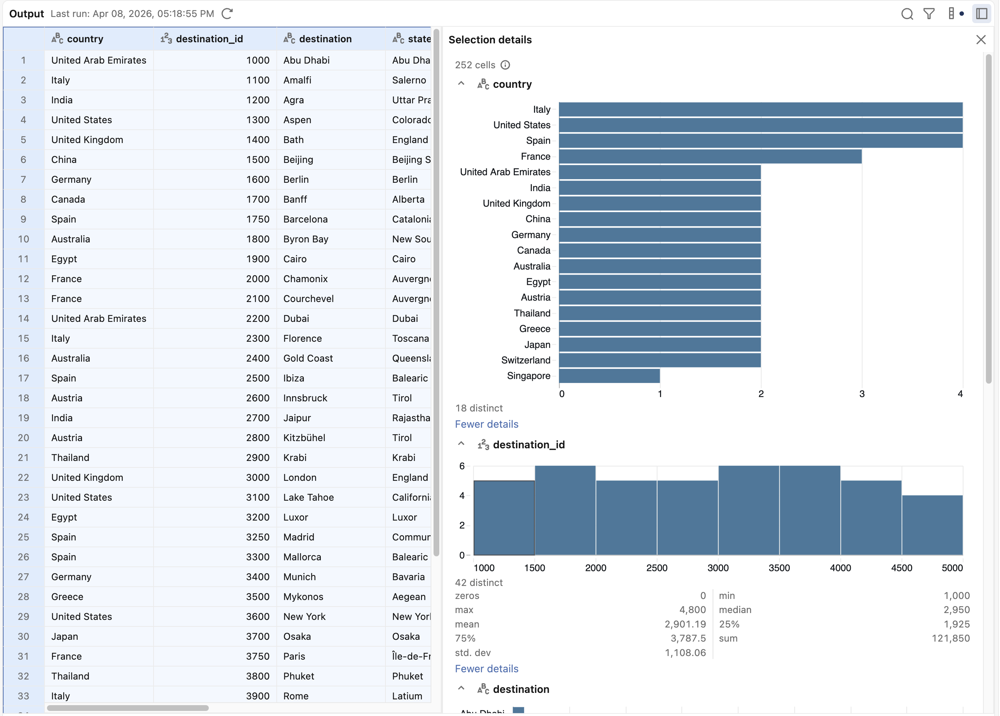

# Lakeflow Designer - Hands-On Lab Guide

> **Scenario:** OTC Derivatives regulatory reporting -- reconciliation, break detection, and Finrep preparation.  
> **Dataset:** Finance/CFT (counterparties, OTC trades, settlements, market data) + Excel regulatory adjustments.  
> **Prerequisite:** Run `data_generation/00_generate_test_data.py` first.  

---

## Module 0 - Setup & Data Verification

### 0.1 Run the data generation notebook

1. In your Databricks workspace, click **New > Notebook**.
2. Import `data_generation/00_generate_test_data.py`.
3. Attach to serverless compute and **Run All**.
4. Confirm you see 4 tables in `lab_lakeflow.cft` plus an Excel file in the Volume.

### 0.2 Verify Unity Catalog access

```sql
USE CATALOG lab_lakeflow;
USE SCHEMA cft;
SHOW TABLES;
```

You should see: `counterparties`, `otc_trades`, `settlements`, `market_data`.

### 0.3 Check the Excel file in the Volume

```sql
LIST '/Volumes/lab_lakeflow/cft/lab_files/';
```

You should see `regulatory_adjustments.xlsx` and `regulatory_adjustments.csv`.

### 0.4 Download the Excel file locally

Download `regulatory_adjustments.xlsx` from the Volume to your local machine. You will drag-and-drop it into Lakeflow Designer in Module 1.

---

## Module 1 - Your First Visual Data Prep: Ingest a UC Table + an Excel File

> **Goal:** Create a pipeline that combines a governed Unity Catalog table with an ad-hoc Excel file from the business -- the core pattern that needs industrializing.  

### 1.1 Create a new Visual Data Prep

1. In the sidebar, click **New > Visual data prep**.
2. The welcome screen appears.

> Sources: Imports data into Designer. The Source operator reads from a Unity Catalog table or other supported sources. It has two stages:

> Selecting a table or file: Search for a table or file by name, or browse by catalog and schema. You can also create a new table from this pane.
> Table summary: After selecting a table, the configuration pane shows the table's name, owner, and last updated time. Click Select a new data source to change the source. Changing the source invalidates the output cache for all downstream operators.

### 1.2 Add a Unity Catalog source

1. Click **Select source** and browse to `lab_lakeflow.cft.otc_trades`.
2. The Source operator appears on the canvas.
3. Click on it - the **output pane** shows a preview (up to 1,000 rows).

### 1.3 Drag-and-drop the Excel file

1. Open your file explorer and locate `regulatory_adjustments.xlsx`.
2. **Drag the file directly onto the canvas.**
3. Lakeflow Designer uploads it and creates a Source operator automatically.
4. Click on the new Source - you see the Adjustments sheet data.

> **Key message:** This is exactly how business teams will work. They have an Excel file with manual adjustments, they drop it on the canvas, and it immediately becomes part of a governed pipeline. No more emailing spreadsheets around.

### 1.4 Explore the canvas

| Action | How |
|---|---|
| Pan | Drag |
| Zoom | Scroll wheel |
| Fit view | Click the fit-to-view icon (toolbar) |
| Auto-layout | Click the auto-layout icon (toolbar) |
| Undo / Redo | `Cmd/Ctrl + Z` / `Cmd/Ctrl + Shift + Z` |

### 1.5 Data profiling

1. Click the OTC trades Source operator.
2. Click the **sidebar icon** (top-right of the output pane) to open **Data Profiling**.
3. Explore distributions: `product_type`, `currency`, `status`, `mtm_eur`.
4. Notice the stats: count, distinct values, nulls, min/max per column.




### 1.6 Sample vs Full dataset

1. Toggle to **Full dataset** and click **Run** -- all 10,000 trades appear.
2. Switch back to **Sample dataset** for faster iteration.

>Just a preview. To exports data out of Designer, you can write results to a table in Unity Catalog.  
>To do so: in the Output configuration pane, specify:  
>Table name: The name of the table to create.  
>Output location: The catalog and schema where the table is created.  
>Click Run to run the Visual data prep and write results.  

---

## Module 2 - Filtering & Sorting

> **Goal:** Filter is part of the transformations that you can perform on your data. Here, we'll hilter trades by status, product type, and sort by exposure.

### 2.1 Filter - Live trades only

1. Click **+** on the `otc_trades` Source.
2. Select **Filter**, name it `Live_trades_only`
3. Configure: Column: `status`, Condition: `Is equal to`, Value: `Live`.
=> Click **Apply**
> Preview: only live trades remain.

### 2.2 Filter - Numeric threshold

1. Add a new Filter after the first one.
2. Column: `notional_amount`, Condition: `Greater than`, Value: `10000000`.
3. Preview: large bilateral live trades only.
=> Click **Apply**

### 2.3 Sort by exposure

1. Click **+** after the filter operator on the `otc_trades` source.
2. Add a **Sort** operator, name it `Sort_by_exposure`.
2. Sort by `mtm_eur` **DESC** (largest positive exposure first).
3. Add secondary sort: `notional_amount` **DESC**.
=> Click **Apply**

### 2.4 Limit

1. Add a **Limit**, name it `Limit_50` operator after the sort operator: 50 rows.
=> Click **Apply**

> You now have the top 50 largest bilateral exposures.

---

## Module 3 - Transforms & Genie Code AI

> **Goal:** Add calculated columns. Show how Genie Code for Natural Language to Transformation.

### 3.1 Transform - Select, rename, reorder

1. To source otc, add a **Transform** operator.
2. **Uncheck** `uti` and `trade_timestamp` (not needed for this report).
3. **Rename** `mtm_eur` to `mark_to_market`.
4. **Rename** `notional_amount` to `notional`.
5. **Reorder**: drag `product_type` above `book`.
=> Click **Apply**

### 3.3 Custom column - Manual expression

1. Click **+ Add a custom column**, switch input field to `Expression`
2. Expression:
   ```
   round(abs(mark_to_market) / notional * 100, 2)
   ```
3. Name: `exposure_pct`
=> Click **Apply** and preview output

### 3.4 Custom column - Genie Code AI (natural language)

1. Click **+ Add a custom column**, use imput field **Description**
2. In the **Description** field, type:
   ```
   Classify the trade risk: "High" if absolute mark_to_market exceeds 1 million, "Medium" if between 100k and 1M, "Low" otherwise
   ```
3. Name: `risk_bucket`
4. Genie generates the CASE expression.
=> Review and **Apply**

### 3.5 Genie Code - Open conversation

1. Open the **Genie Code** panel.
2. Try these prompts:
   - `Add a column days_to_maturity calculated as the number of days between maturity_date and current_date`
   - `Flag trades where maturity_date is before 2026-06-30 as "Near Term" and others as "Long Term"`
   - `Create a column tenor_bucket: "Short" if days_to_maturity < 365, "Medium" if < 1825, "Long" otherwise`
3. Each prompt generates a transformation. Review the code Genie produces.

### 3.6 Genie Code - Advanced prompt

Try: `Calculate the absolute notional in EUR. If the currency is already EUR, keep as-is. For USD use rate 1.08, for GBP use 0.86, for CHF use 0.95, for JPY use 162.5. Name the column notional_eur.`
=> Review and Click **Apply**.


> **Key message** Your business users don't need to learn SQL or Python. They describe what they want, Genie writes the code. And the code is visible and auditable - important for regulatory traceability.

---

## Module 4 - Joins

> **Goal:** Enrich trades with counterparty information and detect settlement breaks.

### 4.1 Enrich trades with counterparty data

1. Add another Source: `counterparties`.
2. Add a **Join** operator between counterparties and otc_trades, name it `enriched_trades`
3. Connect `otc_trades` (left) and `counterparties` (right).
4. Join condition: `otc_trades.counterparty_id = counterparties.counterparty_id`.
5. Join type: **Inner join**.
6. Uncheck duplicate `counterparty_id` in output columns.
=>Click **Apply** and preview output: trades now have counterparty name, rating, type, country.

### 4.2 Add a custom expression in the Join

1. Click **Additional expressions**, **Add a custom column**.
LET'S TRY THE DEBUG FEATURE
2. Expression:
   ```
   concate(counterparty_name, ' (', credit_rating, ' - ', country, ')')
   ```
=> Clic **Apply**, expected behavior is that the expression fails and Genie Code offers to fix it
3. Name: `counterparty_label`
=> Click **Apply** and preview

### 4.3 Detect settlement breaks (Left Join)

1. Add a third Source: `settlements`.
2. Add a new **Join** after the first one sames it `settlement`
3. Connect the enriched trades (left) to settlements (right).
4. Join on: `otc_trades.trade_id = settlements.trade_id`.
5. Join type: **Left join** (trades without settlements = breaks).

=> Click **Apply** and preview: some rows have null `settlement_id` -- these are the breaks.

### 4.4 Filter to show only breaks

1. Add a **Filter** operator `settlement_breaks` after the join.
2. Column: `settlement_id`, Condition: `Is null`.
3. Preview: ~200 trades with no settlement record.

> **Key message:** This is a classic Alteryx reconciliation pattern -- load two datasets, join, find mismatches. In Lakeflow Designer it's the same logic, but governed and scalable.

---

## Module 5 - Aggregations

> **Goal:** Build summary reports for regulatory reporting.

### 5.1 Exposure by counterparty

1. Start from the **Enriched_trades** (Module 4.1 join output).
2. Add an **Aggregate** operator, name it `Exposure_by_counterparty`
3. Configure:
   - **Group by:** `counterparty_name`, `credit_rating`, `counterparty_type`
   - **Aggregations:**
     - `mtm_eur` > **SUM** > `total_mtm`
     - `notional` > **SUM** > `total_notional`
     - `trade_id` > **COUNT** > `trade_count`
     - `mtm_eur` > **MAX** > `max_single_exposure`


### 5.2 Advanced: Percentile analysis

1. New Aggregate after **Enriched_trades**, name it `Percentile_analysis`
   - **Aggregations:**
     - `notional_amount` > **MEDIAN** > `median_notional`
     - `mtm_eur` > **STDDEV**  > `mtm_stddev`
> Returns the sample standard deviation of the numeric expression expr over the input rows
     - `mtm_eur` > **VARIANCE** > `mtm_variance`
   - **Group by:** `product_type`

> **Available functions:** AVG, COUNT, MAX, MEAN, MEDIAN, MIN, STDDEV, SUM, VARIANCE.
> PERCENTILE and STDDEV are built-in.

---

## Module 6 - Combine & Reshape

> **Goal:** Union datasets, pivot for cross-tabulation, unpivot:
>The Combine operator: Takes two input tables with matching schemas (same columns, compatible types).
>Applies a set operation: Union, Intersect, Except
>Then applies a merge strategy:Distinct, All


### 6.1 Combine - Union bilateral and cleared trades

1. To source otc, add two Filters after the source:
   - Filter A: `clearing_type = 'Bilateral'`
   - Filter B: `clearing_type = 'CCP-Cleared'`
2. Add a Transform to each to select the same columns (e.g., `trade_id`, `product_type`, `notional_amount`, `mtm_eur`).
3. Add a **Combine** operator, connect both.
4. Operation: **Union** / **All**.
5. Preview: all trades combined.

### 6.2 Combine - Except (find bilateral-only products)

1. Same setup but change to **Except** / **Distinct**.
2. Preview: products that exist in bilateral but not in cleared.

### 6.3 Pivot - Exposure cross-tab

1. Start from an **Aggregate**: group by `product_type` and `clearing_type`, sum `notional_amount` as `total_notional`.
2. Add a **Pivot** (Reshape) operator.
3. Mode: **Rows to Columns**.
4. Pivot column: `clearing_type`.
5. Value: `total_notional`, Aggregation: **SUM**.
6. Preview: each row is a product type, columns are Bilateral / CCP-Cleared with notional amounts.

### 6.4 Unpivot

1. Add another Pivot in **Columns to Rows** mode.
2. Select the clearing columns to unpivot.
3. Key column: `clearing_type`, Value column: `notional`.
4. Data is back in long format.

---

## Module 7 - SQL & Python Operators

> **Goal:** Handle complex logic that goes beyond built-in operators.

### 7.1 SQL - Window functions for ranking

1. To source: `otc_trades`,Add a **SQL** operator:
   ```sql
   SELECT
     trade_id,
     counterparty_id,
     product_type,
     notional_amount,
     mtm_eur,
     RANK() OVER (PARTITION BY product_type ORDER BY abs(mtm_eur) DESC) AS exposure_rank,
     SUM(notional_amount) OVER (PARTITION BY counterparty_id) AS cpty_total_notional,
     COUNT(*) OVER (PARTITION BY counterparty_id) AS cpty_trade_count
   FROM otc_trades
   WHERE status = 'Live'
   ```

### 7.2 SQL - Settlement break analysis

```sql
SELECT
  t.trade_id,
  t.product_type,
  t.notional_amount,
  s.expected_amount,
  s.actual_amount,
  s.settlement_status,
  CASE
    WHEN s.settlement_id IS NULL THEN 'Missing Settlement'
    WHEN s.actual_amount = 0 THEN 'Failed'
    WHEN abs(s.actual_amount - s.expected_amount) / s.expected_amount > 0.01 THEN 'Amount Mismatch'
    ELSE 'Matched'
  END AS break_type,
  COALESCE(s.actual_amount - s.expected_amount, 0) AS amount_difference
FROM otc_trades t
LEFT JOIN settlements s ON t.trade_id = s.trade_id
WHERE t.status = 'Live'
```

### 7.3 Python - Custom risk calculation

1. Add a **Python** operator:
   ```python
   from pyspark.sql import functions as F

   df = inputs["data"][0]

   result = df.withColumn(
       "pfe_estimate",
       F.when(F.col("product_type") == "IRS",
              F.abs(F.col("notional_amount")) * 0.005 * F.sqrt(F.col("cpty_trade_count")))
        .when(F.col("product_type") == "CDS",
              F.abs(F.col("notional_amount")) * 0.05)
        .when(F.col("product_type").startswith("FX"),
              F.abs(F.col("notional_amount")) * 0.02)
        .otherwise(F.abs(F.col("notional_amount")) * 0.01)
   ).withColumn(
       "pfe_estimate", F.round(F.col("pfe_estimate"), 2)
   )
   ```
2. Preview: potential future exposure (PFE) estimated per trade.

> **Key difference vs Alteryx:** The Python operator runs on Spark -- distributed across the cluster. Alteryx Python tool runs single-threaded on the desktop.

---

## Module 8 - Output, Lineage & Schedule

> **Goal:** Write results to Unity Catalog, show lineage, and schedule the pipeline.

### 8.1 Add an Output operator

1. On any pipeline, click **+** on the last operator.
2. Select **Output**.
3. Configure:
   - Catalog: `lab_lakeflow`
   - Schema: `cft`
   - Table name: `report_settlement_breaks`
4. Click **Run** to materialize.

### 8.2 Verify the output

```sql
SELECT * FROM lab_lakeflow.cft.report_settlement_breaks LIMIT 20;
```

### 8.3 View lineage in Unity Catalog

1. Navigate to **Catalog > lab_lakeflow > cft > report_settlement_breaks**.
2. Click the **Lineage** tab.
3. You can see the full lineage graph: which source tables feed this output, through which transformations.

> **Key message for ECB:** This is the governance story. Every output table has full lineage back to its sources -- including the Excel file that was dropped onto the canvas. This is what ECB auditors want to see: traceability from ad-hoc business inputs to regulatory reports.

### 8.4 Schedule the pipeline

1. Click **Schedule** in the top toolbar.
2. Set frequency (e.g., Daily at 6:00 AM).
3. Save.

### 8.5 Integrate into a Databricks Job

1. **Workflows > Jobs > Create Job**.
2. Add a task of type **Visual data prep**, select your pipeline.
3. Add upstream tasks (data ingestion notebooks) and downstream tasks (report generation, validation).
4. This replaces Alteryx Server for orchestration.

---

## Module 9 - End-to-End Pipeline: Regulatory Report

> **Goal:** Build the complete Finrep-style pipeline from raw data to regulatory output.

### Scenario

Produce a **settlement reconciliation report** that:
- Joins trades with counterparties and settlements
- Incorporates the manual Excel adjustments from the business
- Detects breaks (missing settlements, amount mismatches)
- Aggregates exposure by counterparty and product
- Outputs governed tables ready for Finrep submission

### Step-by-step

#### 1. Sources (4 inputs)
- Source 1: `lab_lakeflow.cft.otc_trades`
- Source 2: `lab_lakeflow.cft.counterparties`
- Source 3: `lab_lakeflow.cft.settlements`
- Source 4: **Drag-and-drop** `regulatory_adjustments.xlsx` onto the canvas

#### 2. Enrich trades with counterparties
- Join `otc_trades` to `counterparties` on `counterparty_id` (Inner join)
- Keep: `trade_id`, `product_type`, `book`, `notional_amount`, `mtm_eur`, `currency`, `status`, `clearing_type`, `counterparty_name`, `credit_rating`, `country`, `counterparty_type`

#### 3. Join with settlements
- Left join on `trade_id`
- Keep: add `settlement_status`, `expected_amount`, `actual_amount`

#### 4. Filter live trades
- Filter: `status = 'Live'`

#### 5. Join with Excel adjustments
- Left join enriched trades to the Excel adjustment data on `trade_id`
- This merges the business team's manual adjustments into the pipeline

#### 6. Transform - Calculate break indicators
Use Genie Code:
- `Add a column break_type: "Missing Settlement" if settlement_status is null, "Failed" if actual_amount is 0, "Amount Mismatch" if absolute difference between actual and expected exceeds 1% of expected, "Adjusted" if adjustment_id is not null, "Matched" otherwise`
- `Add a column adjusted_mtm: if adjusted_value is not null use adjusted_value, otherwise use mtm_eur`

#### 7. Branch 1: Break summary report
- Aggregate: Group by `break_type`, `product_type`. Count `trade_id` as `break_count`, Sum `notional_amount` as `total_notional_at_risk`.
- Output: `lab_lakeflow.cft.report_break_summary`

#### 8. Branch 2: Counterparty exposure report
- Aggregate: Group by `counterparty_name`, `credit_rating`, `country`. Sum `adjusted_mtm` as `total_exposure`, Count `trade_id` as `trade_count`.
- Sort: `total_exposure` DESC.
- Output: `lab_lakeflow.cft.report_counterparty_exposure`

#### 9. Branch 3: Product cross-tab
- Aggregate: Group by `product_type`, `clearing_type`. Sum `notional_amount` as `total_notional`.
- Pivot: Rows to Columns on `clearing_type`.
- Output: `lab_lakeflow.cft.report_product_clearing_matrix`

#### 10. Run, verify lineage, and schedule

```sql
SELECT * FROM lab_lakeflow.cft.report_break_summary;
SELECT * FROM lab_lakeflow.cft.report_counterparty_exposure ORDER BY total_exposure DESC LIMIT 20;
SELECT * FROM lab_lakeflow.cft.report_product_clearing_matrix;
```

Navigate to each table in Unity Catalog and check the **Lineage** tab.

Schedule the pipeline to run daily.

---

## Bonus: Genie Q&A on the Data

After building the pipeline, try Genie for data exploration:

1. Open **Genie Code** on any operator.
2. Try:
   - `@lab_lakeflow.cft.otc_trades - Which counterparties have the highest total notional exposure?`
   - `What percentage of trades have settlement breaks?`
   - `Show me the distribution of MTM values by product type`
   - `Which books have the most failed settlements?`

> **Key message:** Genie is not just for building transformations -- it's also a data Q&A tool. Two use cases in one: transformation building AND data exploration.

---

## Appendix: Genie Code Prompt Library (Finance/CFT)

| Task | Prompt |
|---|---|
| Break detection | `Flag trades where settlement is missing or amount differs by more than 1%` |
| Risk classification | `Classify counterparty risk based on credit rating: Investment Grade if BBB- or above, High Yield otherwise` |
| Notional bucketing | `Create notional buckets: <1M, 1-10M, 10-50M, 50-100M, >100M` |
| Tenor calculation | `Calculate days to maturity and classify as Short (<1Y), Medium (1-5Y), Long (>5Y)` |
| MTM currency conversion | `Convert mtm_eur to USD using rate 1.08` |
| Netting | `Calculate net exposure per counterparty (sum of positive and negative MTM)` |
| Regulatory threshold | `Flag trades where notional exceeds the materiality threshold for their product type` |
| Data quality | `Find trades where counterparty_id does not match any record in the counterparties table` |
| Dedup | `Remove duplicate trades based on trade_id, keeping the most recent by trade_timestamp` |
| Running exposure | `Add a running total of MTM by counterparty ordered by trade_date` |

---

## Appendix: Known Gaps vs Alteryx

Be transparent about what Lakeflow Designer does not (yet) do:

| Alteryx Capability | Lakeflow Designer Status |
|---|---|
| Spatial analytics | Not in Designer. Use H3 / Mosaic in notebooks. |
| Predictive/ML blocks | Not in Designer. Use AutoML / MosaicAI. |
| PDF report generation | Not in Designer. Use AI/BI Dashboards. |
| Macro system (reusable workflows) | Not yet available. Use parameterized notebooks. |
| Desktop offline mode | Designer is cloud-only (browser-based). |

